# Boardify – Student Accommodation Finder in Sri Lanka

**Boardify** is a modern, secure, and user-friendly web platform designed to help university students in Sri Lanka easily find safe and suitable accommodation. This platform connects students searching for housing with property owners while ensuring verified and reliable listings through an admin panel.

---

## 🚀 Features

### User Features
- Sign up and log in (also supports Google login)  
- Dashboard with ad statistics and notifications  
- Browse all ads with search and filter options  
- View detailed property information including photos, amenities, and location  
- Post property ads for rent with admin verification  
- Send and receive booking requests  
- Profile management and edit own ads  

### Admin Features
- Admin dashboard with system statistics and charts  
- User management (edit/remove users)  
- Approve or reject pending property listings  
- View all listings including booked properties  
- Admin profile management  

---

## 💻 Technologies Used
- **Backend:** Java Spring Boot (REST Controllers)  
- **Database:** MySQL / PostgreSQL  
- **Security:** Spring Security with JWT Authentication  
- **ORM:** Spring Data JPA  
- **API Integrations:** LocationIQ, Voyage, ImgBB (for image hosting)  
- **API Testing:** Postman  

---

## 📸 Screenshots

### 🔑 Authentication
- **Login Page**
  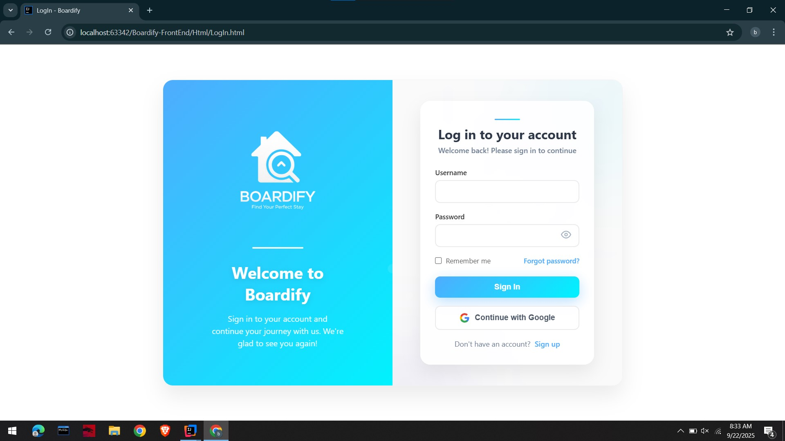

- **Sign Up Page**
  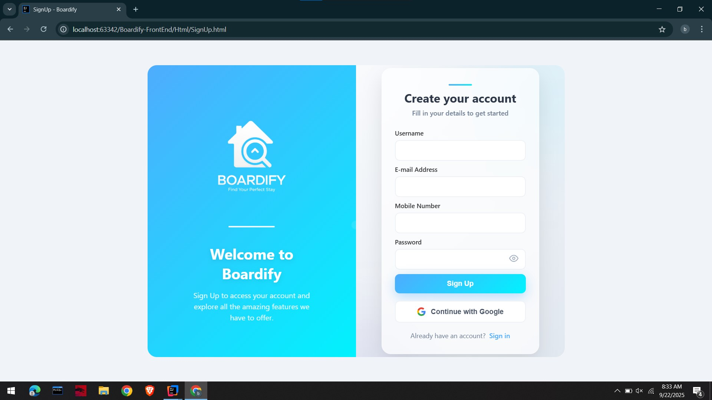

### 🏠 User Side
- **Landing Page**
  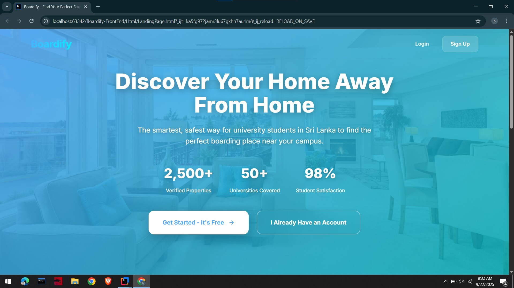

- **User Dashboard**
  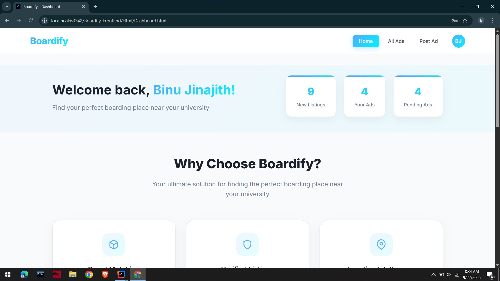

- **User Profile**
  

- **User Ads**
  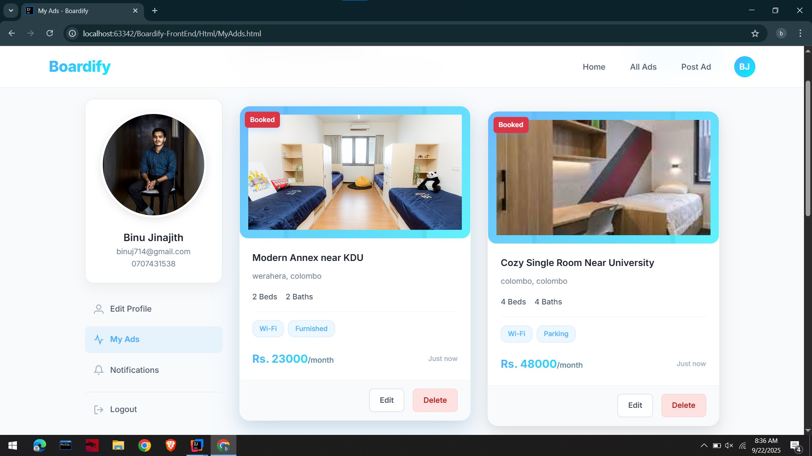

- **All Ads**
  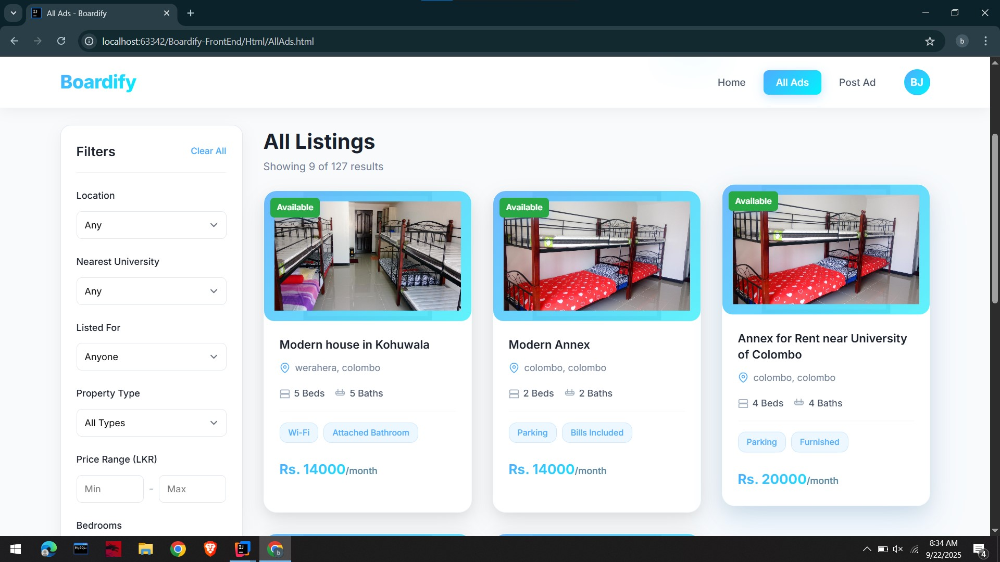

- **Booking Ad**
  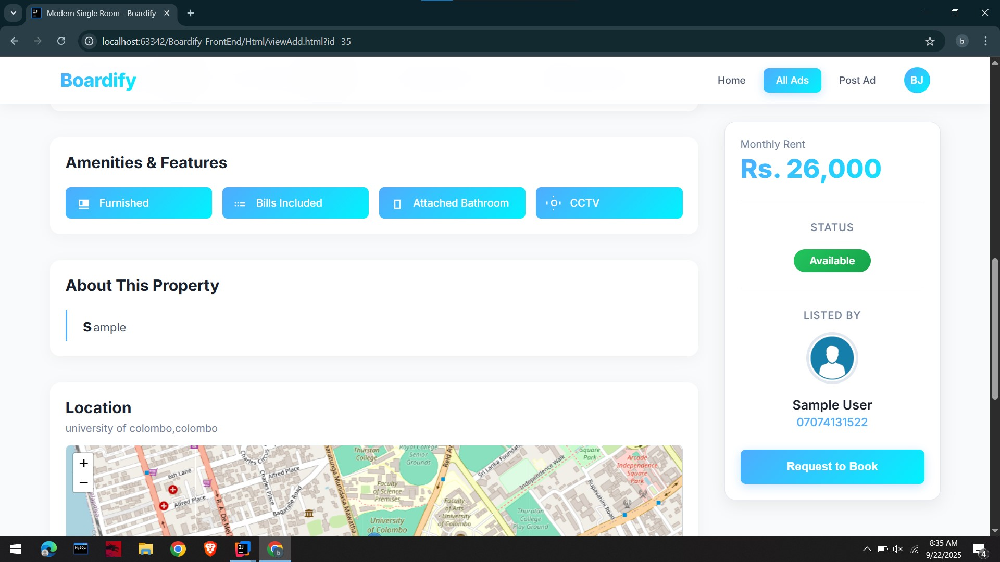

- **Post Ad**
  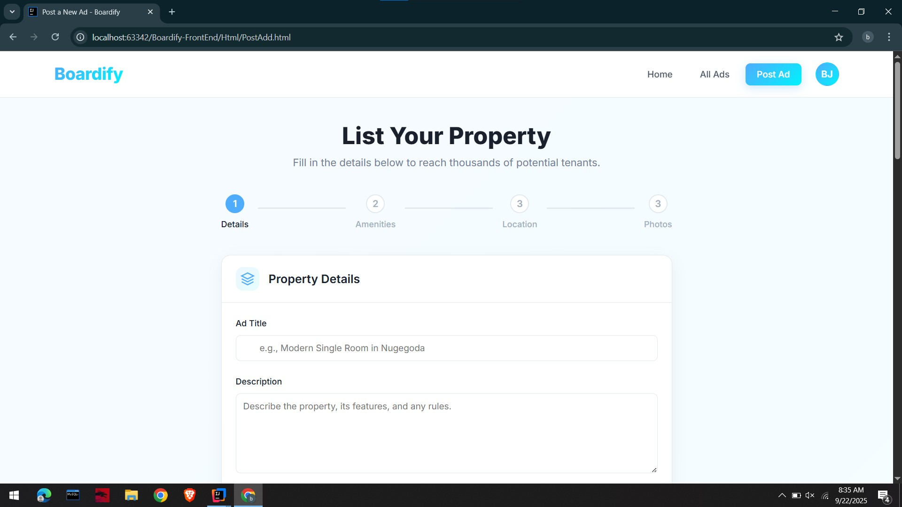

- **Notifications**
  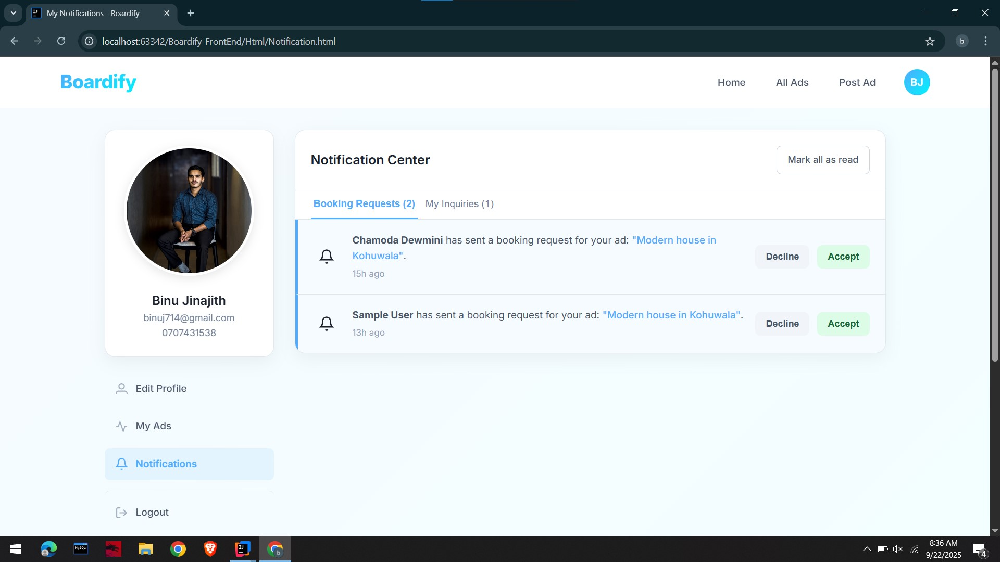

### 👨‍💼 Admin Side
- **Admin Dashboard**
  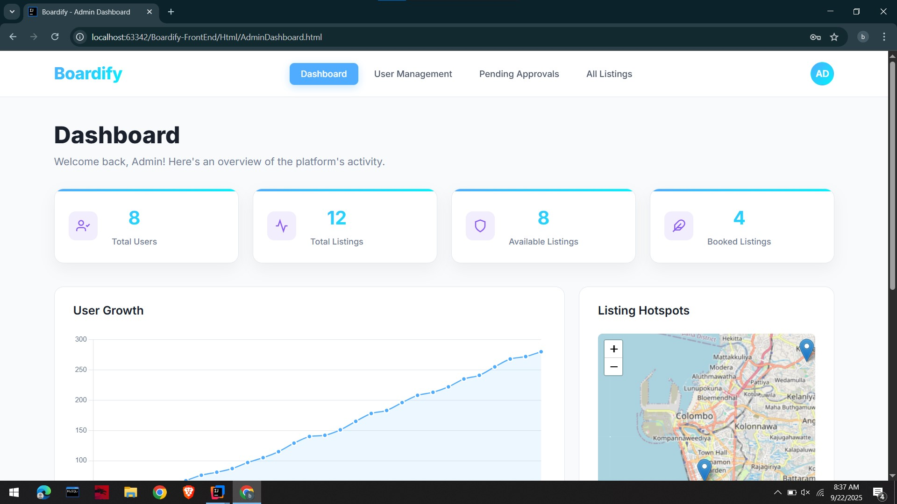

- **Admin Profile**
  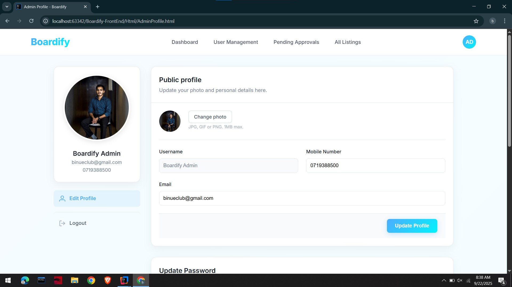

- **Manage Users**
  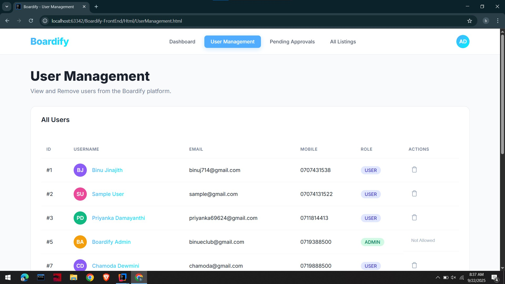

- **View Ads**
  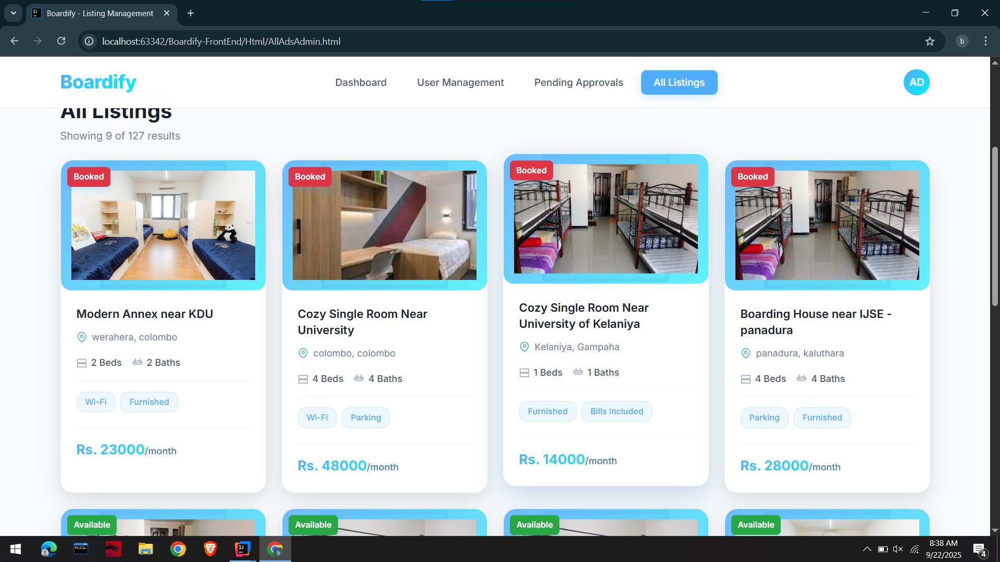

- **Confirm Ads**
  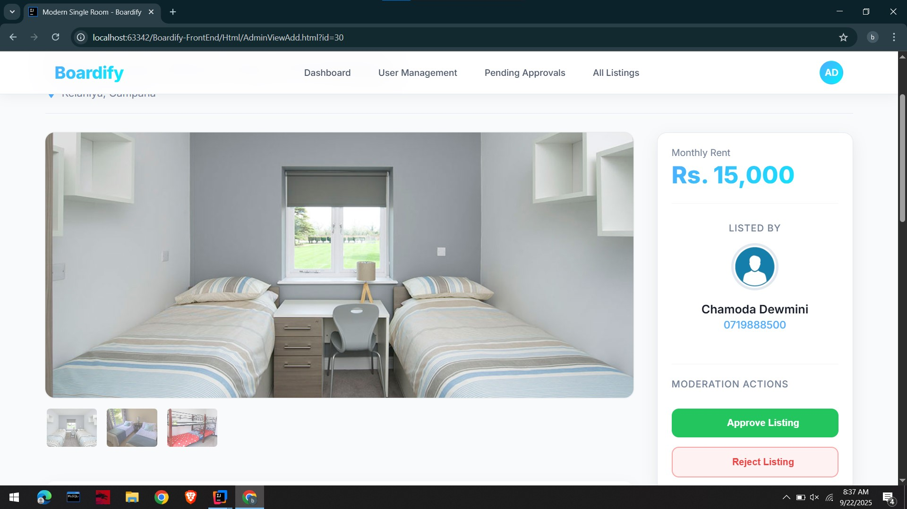

## 🎥 Demo Video
Watch the full project demonstration here:  
[https://youtu.be/uHcjZ4TLW-E](https://youtu.be/XbZz5JYh990?si=MePBvUnr_3Aae_I6)

---

## 🏠 Sample Property Ads
Boardify supports listings like **Houses, Annexes, Single Rooms, Shared Rooms** near Sri Lankan universities. Features include price, bedrooms/bathrooms, amenities, nearest campus, city, and district.  

---

## 📂 Project Structure
- **Controllers:** Handle REST endpoints and requests  
- **Services:** Business logic and service layer  
- **Repositories:** Database operations using Spring Data JPA  
- **Entities:** Represent database tables (Users, Properties, Ads, Bookings, etc.)  
- **Security:** JWT-based authentication and authorization  

---
